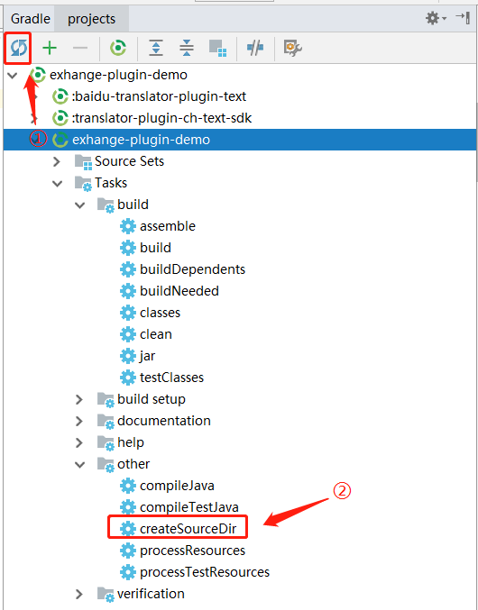
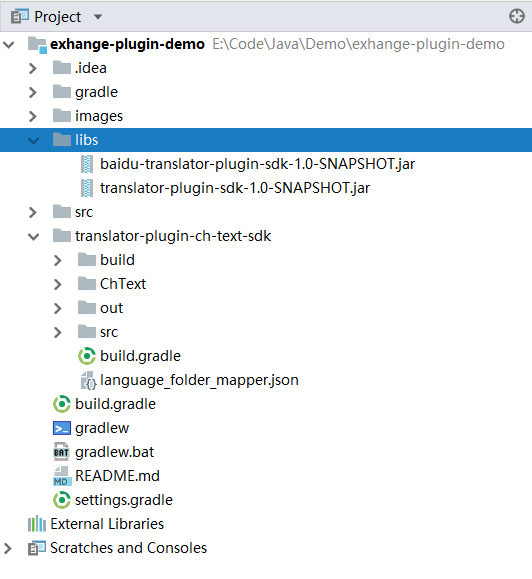
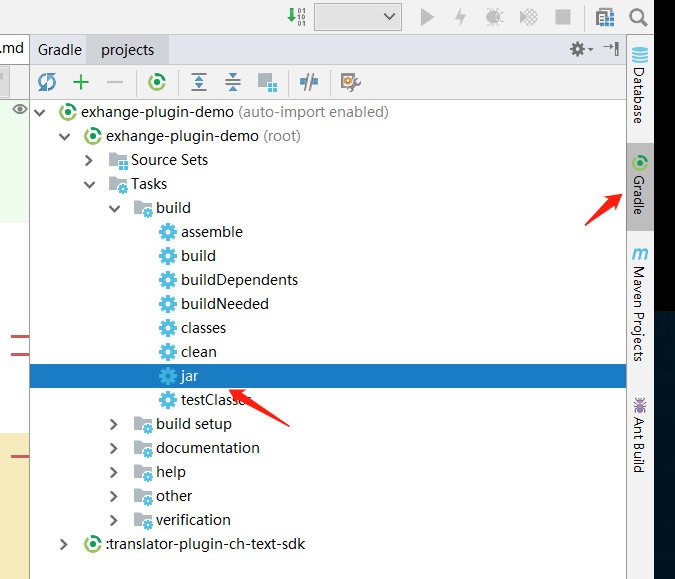
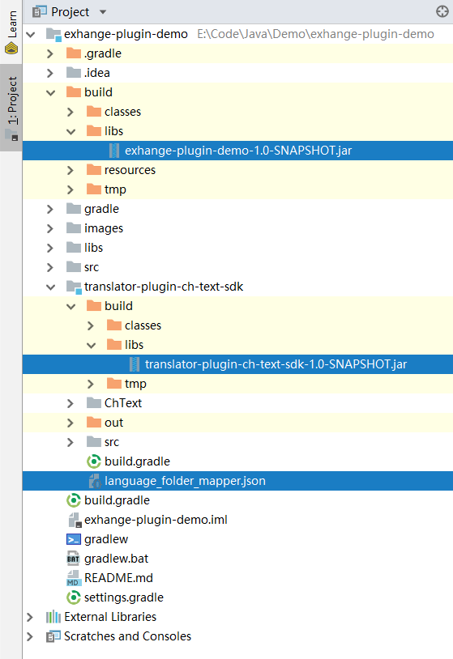

exchange-plugin-demo
====================

This is a ```exchange``` plugin demo, plugin host project here [exchange][1].

### How to create a plugin

#### 1. Create plugin project.

I suggest you to create a **Gradle** java project. Because the plugin 
host is using is project structure, it will help you be familiar with 
the whole project.

**TIPS:**

If your project doesn't create a source folder, you can add this code 
in your project root ```build.gradle``` file:

```groovy
//plugins {
//    id 'java'
//}
//
//repositories {
//    mavenCentral()
//}
//
//dependencies {
//}

// add script
task createSourceDir {

    doLast{
        sourceSets*.java.srcDirs*.each { it.mkdirs() }
        sourceSets*.resources.srcDirs*.each { it.mkdirs() }
    }

}
```

Then, update gradle file:



1. sync gradle file
2. execute this task

#### 2. Choose the translate platform.

First you should choose the translate platform, if you don't need 
a new platform you can just copy exist plugin into ```release.zip```
file ```~/plugins/sdk/[google|baidu|youdao]``` 's folder *.jar to 
your project ```libs``` path.

Then, add **libs** folder to your build classpath, with this dependency.

```groovy
dependencies {
    ...

    // compile local libs dir
    compile fileTree(dir:'libs',include:['*.jar'])

    ...
}
```

the folder structure is this:



after that, you should sync gradle again(each time you add new jar files you should sync gradle.).

#### 3. Choose typed text plugin.

The main goal is translate typed text to another language. So parse an typed text is important.

if you don't need new doc type, you can just copy copy exist plugin into ```release.zip```
file ```~/plugins/sdk/[android|ios]```'s folder *.jar to your project libs path.

Or you can create a new typed text plugin yourself.

#### 4. Create typed text plugin.

1. Add new Module to your project, i recommend module name as 
**translator-plugin-<typed-text-name>-sdk**.

2. Add libs to your module:

```groovy
dependencies {
    ...

    // compile local libs dir
    compile fileTree(dir:'../libs',include:['*.jar'])
}
```

3. I recommend you to create a ```Document``` class to parse typed text file, it will 
use to parse typed text file and rewrite file.

```java
package io.github.onlynight.exchange.typed.text.plugin.sdk.doc;

import java.io.*;
import java.util.ArrayList;
import java.util.Arrays;
import java.util.List;

/**
 * Chinese text document parse class
 */
public class DocumentChText {

	// parsed each sentence.
	private List<String> sentences = new ArrayList<>();

	private String path;

	public DocumentChText(String path) {
		this.path = path;
	}

	/**
	 * create document with sentences, and specific the result path.
	 *
	 * @param path      result path
	 * @param sentences sentences
	 */
	public DocumentChText(String path, List<String> sentences) {
		this.sentences = sentences;
		this.path = path;
	}

	public DocumentChText parse() {
		try {
			BufferedReader reader = new BufferedReader(
					new InputStreamReader(new FileInputStream(new File(path)), "utf-8"));
			String line;
			StringBuilder sb = new StringBuilder();
			while ((line = reader.readLine()) != null) {
				sb.append(line);
			}
			reader.close();
			String[] res = sb.toString().split("。");
			for (int i = 0; i < res.length; i++) {
				res[i] += "。";
			}
			sentences = Arrays.asList(res);
		} catch (IOException e) {
			e.printStackTrace();
		}

		return this;
	}

	public void writeDocument() {
		try {
			FileOutputStream fos = new FileOutputStream(new File(path));
			for (String sentence : sentences) {
				fos.write(sentence.getBytes());
			}
			fos.close();
		} catch (IOException e) {
			e.printStackTrace();
		}
	}

	public List<String> getSentences() {
		return sentences;
	}

	public String getPath() {
		return path;
	}
}
```

4. Create a Base Translator java class. It will parse typed text doc file and use some
```TranslatorHandler``` to translate text.

```java
package io.github.onlynight.exchange.typed.text.plugin.sdk;

import io.github.onlynight.exchange.plugin.sdk.BaseTranslatorPlugin;
import io.github.onlynight.exchange.plugin.sdk.TranslatorHandler;
import io.github.onlynight.exchange.typed.text.plugin.sdk.doc.DocumentChText;

import java.io.File;
import java.util.ArrayList;
import java.util.List;

/**
 * @param <Handler> You will set the final class TranslatorHandler in this translator.
 */
public abstract class ChTextTranslator<Handler extends TranslatorHandler> extends BaseTranslatorPlugin<Handler> {

	public static final String TEXT_TYPE_CH_TEXT = "ch-text";

	public static final String PATH = "plugins/sdk/ch-text";

	/**
	 * translate result path
	 *
	 * @param destLanguage
	 * @return
	 */
	@Override
	protected String getValuesFolderName(String destLanguage) {
		return "translated";
	}

	/**
	 * translate text type, it will set int translate_config.ini file
	 * [text type]
	 * textType = ch-text
	 *
	 * @return
	 */
	@Override
	public String textType() {
		return TEXT_TYPE_CH_TEXT;
	}

	/**
	 * the plugin will install path, it will use to load config file.
	 * And you should put the plugin and config file in it.
	 *
	 * @return
	 */
	@Override
	public String getPluginRelativePath() {
		return PATH;
	}

	/**
	 * translate access point.
	 *
	 * in this method you should use
	 * {@link io.github.onlynight.exchange.plugin.sdk.TranslatorPlugin#innerTranslate(String, String, String)}
	 * to translate text,
	 *
	 * @param srcLanguage  source language
	 * @param destLanguage destination language
	 */
	@Override
	public void translate(String srcLanguage, String destLanguage) {
		File file = new File(translatePath);
		File[] files = file.listFiles();
		if (files != null) {
			for (File docFile : files) {
				if (docFile.isFile()) {
					translate(new DocumentChText(docFile.getAbsolutePath()).parse(),
							srcLanguage, destLanguage);
				}
			}
		}
	}

	private void translate(DocumentChText document, String srcLanguage, String destLanguage) {
		List<String> sentences = document.getSentences();
		List<String> result = new ArrayList<>();
		if (sentences != null) {
			for (String sentence : sentences) {
				// use inner translator to translate text.
				String translated = innerTranslate(sentence, srcLanguage, destLanguage);
				System.out.println(sentence + " TRANSLATE TO ===> " + translated);
				result.add(translated);
			}
		}
		File srcDocFile = new File(document.getPath());
		File translateOutPath = new File(srcDocFile.getParent(), getValuesFolderName(destLanguage));
		if (!translateOutPath.exists()) {
			translateOutPath.mkdirs();
		}
		String finalPath = new File(translateOutPath, srcDocFile.getName()).getAbsolutePath();
		new DocumentChText(finalPath, result).writeDocument();
	}

}
```

5. Create ```language_folder_mapper.json``` in the module root path. ```BaseTranslatorPlugin``` 
will load this into ```BaseTranslatorPlugin#languageFolderMapper```, it should indicate destation 
language's out result folder name. if you don't need this method , you can just write ```[]``` in
the file.

```json
[
	{
		"key": "zh-CN",
		"value": "zh-Hans.lproj"
	},
	{
        "key": "en",
        "value": "en.lproj"
    }
]
```

```
"key": "zh-CN", // language name in support_language.txt
"value": "zh-Hans.lproj" // out result folder name
```

```
// this could generate with code, so you can use code to simplify this config.
{
    "key": "en",
    "value": "en.lproj"
}
```

#### 5. Create final translator class.

In the project src folder create this class:

```java
package io.github.onlynight.exchange.plugin.demo;

import io.github.onlynight.exchange.translator.baidu.BaiduTranslatorHandler;
import io.github.onlynight.exchange.typed.text.plugin.sdk.ChTextTranslator;

/**
 * this class just do nothing,
 * but set the {@link ChTextTranslator}'s {@link TranslatorHandler} class.
 * The {@link io.github.onlynight.exchange.plugin.sdk.BaseTranslatorPlugin} class
 * will create Handler and use it.
 */
public class BaiduChTextTranslator extends ChTextTranslator<BaiduTranslatorHandler> {
}
```

Create ```plugin.json``` file in the resources folder, this file will 
define the plugin important infomation:

```json
{
	"platform": "baidu",
	"plugins": [
		{
			"name": "BaiduChTextTranslator",
			"textType": "ch-text",
			"entryPoint": "io.github.onlynight.exchange.plugin.demo.BaiduChTextTranslator" // the plugin class
		}
	]
}
```

```
{
	"platform": "baidu", // translate platform, that will use in config file
	// you can define multi plugins here.
	"plugins": [
		{
			"name": "BaiduChTextTranslator",
			"textType": "ch-text", // typed text name
			"entryPoint": "io.github.onlynight.exchange.plugin.demo.BaiduChTextTranslator" // the plugin class
		}
	]
}
```


#### 6. Build final jar files



copy the final jar file to the ```~/plugins``` dir:



- **Copy ```exhange-plugin-demo-1.0-SNAPSHOT.jar``` into ```~/plugins/``` folder**
- **Copy ```translator-plugin-ch-text-sdk-1.0-SNAPSHOT.jar``` and 
```language_folder_mapper.json``` into ```~/plugins/sdk/ch-text/``` path
(which you return in the ChTextTranslator#getPluginRelativePath)**

#### 7. Change the ```translate_config.ini``` file and run.

[1]: https://github.com/onlynight/exchange
